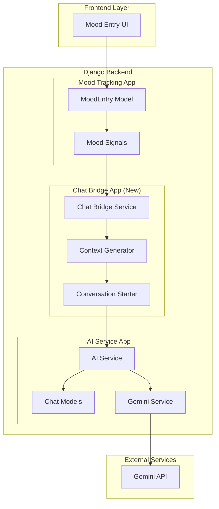
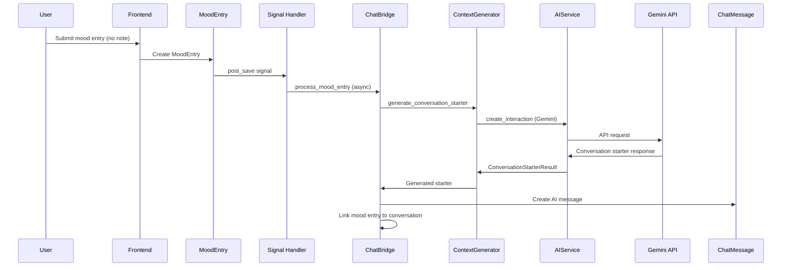
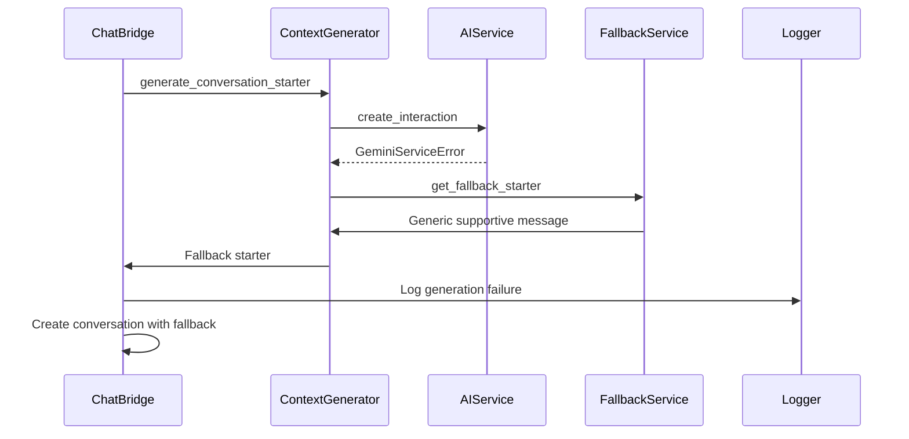

# Mood-to-Chat Bridge - Technical Design Document

## Overview

The Mood-to-Chat Bridge feature creates an intelligent integration layer between the existing mood tracking system and AI conversation service. This system automatically detects when users submit mood entries without personal notes and generates contextually appropriate conversation starters to initiate therapeutic AI interactions.

The design leverages Django's signal system for loose coupling, implements asynchronous processing for performance, and extends the existing AI service infrastructure without disrupting current functionality.

## Architecture

### High-Level Architecture



### Component Interaction Flow

1. **Mood Entry Creation**: User submits mood entry through existing UI
2. **Signal Detection**: Django post_save signal detects note-less entries
3. **Context Generation**: Chat Bridge analyzes mood data and generates conversation context
4. **AI Processing**: Context Generator creates personalized conversation starter via Gemini
5. **Conversation Integration**: Chat Bridge integrates starter into existing conversation system

## Components and Interfaces

### 1. Chat Bridge Service (`ChatBridgeService`)

**Purpose**: Orchestrates the mood-to-chat integration workflow

**Key Methods**:
```python
class ChatBridgeService:
    def process_mood_entry(self, mood_entry: MoodEntry) -> Optional[str]
    def should_generate_conversation(self, mood_entry: MoodEntry) -> bool
    def get_or_create_daily_conversation(self, user: User) -> Conversation
    def handle_generation_failure(self, mood_entry: MoodEntry, error: Exception) -> None
```

**Responsibilities**:
- Validates mood entry eligibility for conversation generation
- Manages conversation creation/continuation logic
- Handles error scenarios gracefully
- Coordinates between Context Generator and AI Service

### 2. Context Generator (`MoodContextGenerator`)

**Purpose**: Interprets mood data and generates conversation context

**Key Methods**:
```python
class MoodContextGenerator:
    def generate_conversation_starter(self, mood_entry: MoodEntry) -> ConversationStarterResult
    def interpret_mood_level(self, mood_level: int) -> MoodInterpretation
    def analyze_stress_factors(self, stress_factors: List[str]) -> StressAnalysis
    def create_contextual_prompt(self, mood_data: MoodContext) -> str
```

**Mood Interpretation Logic**:
- **Levels 1-2**: Distressed states requiring empathetic, supportive responses
- **Level 3**: Neutral states needing gentle exploration
- **Levels 4-5**: Positive states suitable for growth-focused conversations

### 3. Conversation Starter Schema

**New Pydantic Schema**:
```python
class ConversationStarterResult(BaseModel):
    starter_text: str = Field(description="Generated conversation opener (50-150 words)")
    mood_interpretation: str = Field(description="AI's interpretation of user's mood")
    conversation_tone: str = Field(description="empathetic, exploratory, or growth-focused")
    stress_acknowledgment: List[str] = Field(description="Specific stress factors addressed")
    engagement_question: str = Field(description="Open-ended question to encourage response")
```

### 4. Signal Handler Integration

**Django Signal Implementation**:
```python
@receiver(post_save, sender=MoodEntry)
def handle_mood_entry_created(sender, instance, created, **kwargs):
    if created and not instance.note:
        # Trigger async conversation generation
        generate_conversation_starter.delay(instance.id)
```

## Data Models

### Existing Models (No Changes Required)

The design leverages existing models without schema modifications:

- **MoodEntry**: Contains mood_level, stress_category, note, timestamp
- **Conversation**: Groups related chat messages
- **ChatMessage**: Stores user and AI messages with metadata

### New Model: MoodConversationLink

**Purpose**: Track relationships between mood entries and generated conversations

```python
class MoodConversationLink(models.Model):
    id = models.UUIDField(primary_key=True, default=uuid.uuid4)
    mood_entry = models.OneToOneField(MoodEntry, on_delete=models.CASCADE)
    conversation = models.ForeignKey(Conversation, on_delete=models.CASCADE)
    starter_message = models.ForeignKey(ChatMessage, on_delete=models.SET_NULL, null=True)
    generation_status = models.CharField(max_length=20, choices=STATUS_CHOICES)
    created_at = models.DateTimeField(auto_now_add=True)
    
    class Meta:
        indexes = [
            models.Index(fields=['mood_entry']),
            models.Index(fields=['conversation']),
        ]
```

## Data Flow

### Primary Flow: Successful Generation



### Error Handling Flow



## API Design

### Internal Service APIs

**ChatBridgeService API**:
```python
# Primary integration method
def process_mood_entry(self, mood_entry: MoodEntry) -> Optional[str]:
    """
    Process a mood entry for conversation generation.
    Returns conversation ID if successful, None if skipped.
    """

# Conversation management
def get_or_create_daily_conversation(self, user: User) -> Conversation:
    """
    Get existing daily conversation or create new one.
    Implements daily conversation grouping logic.
    """
```

**MoodContextGenerator API**:
```python
def generate_conversation_starter(self, mood_entry: MoodEntry) -> ConversationStarterResult:
    """
    Generate contextual conversation starter from mood data.
    Handles all mood levels and stress factor combinations.
    """

def create_contextual_prompt(self, mood_data: MoodContext) -> str:
    """
    Create Gemini prompt incorporating mood interpretation.
    Follows professional prompting framework.
    """
```

### External API Impact

**No new external endpoints required**. The feature integrates with existing:
- Mood tracking endpoints (unchanged)
- Chat API endpoints (unchanged)
- AI service endpoints (internal extension only)

## Integration Points

### 1. Mood Tracking App Integration

**Signal-Based Integration**:
```python
# In mood_tracking/signals.py (new file)
from django.db.models.signals import post_save
from django.dispatch import receiver
from .models import MoodEntry
from apps.chat_bridge.tasks import generate_conversation_starter

@receiver(post_save, sender=MoodEntry)
def handle_mood_entry_created(sender, instance, created, **kwargs):
    if created and not instance.note.strip():
        generate_conversation_starter.delay(instance.id)
```

**Why Signal-Based**:
- Loose coupling between apps
- Non-blocking mood entry creation
- Easy to disable/modify without touching core mood tracking
- Follows Django best practices

### 2. AI Service Integration

**Service Extension**:
```python
# Extend existing ChatService
class MoodAwareChatService(ChatService):
    def create_mood_based_conversation(
        self, 
        mood_entry: MoodEntry,
        conversation: Conversation
    ) -> ChatMessage:
        """Create conversation starter from mood context."""
```

**Gemini Prompt Template**:
```python
MOOD_CONVERSATION_PROMPT = """
[Persona] You are MindMate, a warm AI companion specializing in mood-based support.

[Action] Create a conversation starter based on the user's mood entry.

[Context] User submitted: Mood {mood_level}/5, Stress: {stress_factors}

[Format] Return JSON with ConversationStarterResult schema.

[Constraints]
- 50-150 words for starter_text
- Reference specific stress factors
- End with engaging question
- Match tone to mood level (empathetic for 1-2, exploratory for 3, growth-focused for 4-5)
"""
```

### 3. User Authentication Integration

**Seamless Auth Integration**:
- Uses existing Django authentication middleware
- Respects user permissions and session management
- No additional authentication layers required

## Error Handling

### Error Categories and Responses

**1. AI Service Unavailable**
```python
class AIServiceUnavailableError(Exception):
    """Gemini API is down or unreachable"""

# Response: Use fallback conversation starters
# Retry: Queue for retry in 5 minutes
# User Impact: Minimal - still gets conversation support
```

**2. Invalid Mood Data**
```python
class InvalidMoodDataError(Exception):
    """Mood entry data is incomplete or invalid"""

# Response: Skip conversation generation
# Logging: Log data validation failure
# User Impact: None - mood tracking continues normally
```

**3. Conversation Creation Failure**
```python
class ConversationCreationError(Exception):
    """Failed to create or link conversation"""

# Response: Log error, continue without linking
# Retry: No retry needed
# User Impact: Minimal - can still access chat manually
```

### Fallback Mechanisms

**Tiered Fallback Strategy**:

1. **Primary**: Gemini-generated contextual starter
2. **Secondary**: Template-based starter using mood level
3. **Tertiary**: Generic supportive message

**Fallback Templates**:
```python
FALLBACK_STARTERS = {
    (1, 2): "I notice you're having a tough time right now. Sometimes it helps to talk through what's on your mind. What's been weighing on you today?",
    (3,): "It sounds like you're in a reflective space today. How are you feeling about things right now?",
    (4, 5): "I'm glad to hear you're doing well! What's been going right for you lately?"
}
```

### Monitoring and Alerting

**Key Metrics to Track**:
- Conversation generation success rate (target: 99%)
- Average generation time (target: <3 seconds)
- Fallback usage rate (monitor for API issues)
- User engagement with generated conversations

## Performance Optimization

### Asynchronous Processing

**Celery Task Implementation**:
```python
@shared_task(bind=True, max_retries=3)
def generate_conversation_starter(self, mood_entry_id: str):
    """
    Async task for conversation generation.
    Prevents blocking mood entry creation.
    """
    try:
        mood_entry = MoodEntry.objects.get(id=mood_entry_id)
        bridge_service = ChatBridgeService()
        bridge_service.process_mood_entry(mood_entry)
    except Exception as exc:
        # Exponential backoff retry
        raise self.retry(exc=exc, countdown=60 * (2 ** self.request.retries))
```

**Why Async**:
- Mood entry creation remains fast (<200ms)
- AI generation happens in background (2-3 seconds)
- User doesn't wait for AI processing
- Retry capability for transient failures

### Caching Strategy

**Template Caching**:
```python
# Cache fallback templates and mood interpretations
@cache_result(timeout=3600)  # 1 hour
def get_mood_interpretation(mood_level: int, stress_factors: List[str]) -> str:
    """Cache mood interpretation logic"""
```

**Conversation Caching**:
```python
# Cache daily conversation lookup
@cache_result(timeout=1800)  # 30 minutes
def get_daily_conversation(user_id: str, date: str) -> Optional[str]:
    """Cache daily conversation ID lookup"""
```

### Database Optimization

**Efficient Queries**:
```python
# Optimized conversation lookup
def get_or_create_daily_conversation(self, user: User) -> Conversation:
    today = timezone.now().date()
    return Conversation.objects.select_related('user').filter(
        user=user,
        created_at__date=today,
        is_active=True
    ).first() or self._create_daily_conversation(user)
```

**Indexes**:
- `MoodConversationLink`: Index on mood_entry and conversation
- `Conversation`: Composite index on (user, created_at, is_active)
- `ChatMessage`: Existing indexes sufficient

## Security Considerations

### Data Privacy

**Mood Data Handling**:
- Mood data only accessed for authenticated user
- No persistent storage of mood data in bridge service
- Conversation starters don't expose raw mood scores
- Follows existing data retention policies

**Access Control**:
```python
def process_mood_entry(self, mood_entry: MoodEntry) -> Optional[str]:
    # Verify user authentication through existing middleware
    # No additional access control needed - inherits from mood tracking
    if not mood_entry.user.is_authenticated:
        raise PermissionDenied("User not authenticated")
```

### API Security

**Rate Limiting**:
- Inherits existing AI service rate limits
- Additional per-user limits on conversation generation
- Prevents abuse of automatic generation

**Input Validation**:
```python
def validate_mood_entry(self, mood_entry: MoodEntry) -> bool:
    """Validate mood entry data before processing"""
    return (
        1 <= mood_entry.mood_level <= 5 and
        mood_entry.stress_category in dict(MoodEntry.STRESS_CATEGORIES) and
        mood_entry.user_id is not None
    )
```

### Error Information Disclosure

**Safe Error Handling**:
- Generic error messages to users
- Detailed errors only in server logs
- No exposure of internal system details
- Graceful degradation without revealing failures

## Testing Strategy

### Unit Testing Approach

**Service Layer Tests**:
```python
class TestChatBridgeService(TestCase):
    def test_process_mood_entry_with_note_skips_generation(self):
        """Entries with notes should not trigger conversation generation"""
    
    def test_process_mood_entry_creates_conversation(self):
        """Valid note-less entries should create conversations"""
    
    def test_daily_conversation_reuse(self):
        """Multiple entries same day should reuse conversation"""
```

**Context Generator Tests**:
```python
class TestMoodContextGenerator(TestCase):
    def test_mood_level_interpretation(self):
        """Each mood level should generate appropriate tone"""
    
    def test_stress_factor_integration(self):
        """Stress factors should be referenced in starters"""
    
    def test_conversation_starter_length(self):
        """Generated starters should be 50-150 words"""
```

### Property-Based Testing

Before writing the correctness properties, I need to analyze the acceptance criteria for testability:

<function_calls>
<invoke name="prework">
<parameter name="featureName">mood-to-chat-bridge

## Correctness Properties

*A property is a characteristic or behavior that should hold true across all valid executions of a system-essentially, a formal statement about what the system should do. Properties serve as the bridge between human-readable specifications and machine-verifiable correctness guarantees.*

### Property Reflection

After analyzing the acceptance criteria, I identified several areas where properties can be consolidated:

**Redundancy Elimination**:
- Properties 2.1, 2.2, 2.3 (mood level interpretation) can be combined into a single comprehensive mood classification property
- Properties 3.1, 3.2, 3.3 (conversation starter tone) can be combined with the mood classification property
- Properties 4.2 and 4.3 (conversation creation logic) can be combined into a single conversation management property
- Properties 6.1, 6.2, 6.5 (system integration) can be combined into a comprehensive integration property

### Property 1: Mood Entry Processing Eligibility

*For any* mood entry, the Chat_Bridge should process it for conversation generation if and only if the entry has no note and contains valid mood level and stress factors.

**Validates: Requirements 1.1, 1.2, 1.3**

### Property 2: Mood Level Classification and Response Tone

*For any* mood entry with valid data, the Context_Generator should classify mood levels 1-2 as distressed (requiring empathetic responses), level 3 as neutral (requiring exploratory responses), and levels 4-5 as positive (requiring growth-focused responses).

**Validates: Requirements 2.1, 2.2, 2.3, 3.1, 3.2, 3.3**

### Property 3: Stress Factor Integration

*For any* mood entry with selected stress factors, the Context_Generator should incorporate all stress factors into the conversation context and reference them specifically in the generated starter.

**Validates: Requirements 2.4, 2.5, 3.4**

### Property 4: Conversation Starter Format Compliance

*For any* generated conversation starter, it should be between 50-150 words and end with an open-ended question.

**Validates: Requirements 3.5, 3.6**

### Property 5: Daily Conversation Management

*For any* user and conversation starter generation, the Chat_Bridge should create a new conversation if no active conversation exists for the current day, or append to the existing daily conversation if one exists.

**Validates: Requirements 4.1, 4.2, 4.3**

### Property 6: AI Service Integration Consistency

*For any* generated conversation starter, the AI_Service should process it as initial context and the Chat_Bridge should maintain the connection between the mood entry and resulting conversation.

**Validates: Requirements 4.4, 4.5**

### Property 7: System Integration Compatibility

*For any* Chat_Bridge operation, it should integrate with existing models without schema changes, use existing AI_Service infrastructure, and respect existing authentication patterns.

**Validates: Requirements 6.1, 6.2, 6.5**

### Property 8: Error Resilience

*For any* error during conversation generation, the Chat_Bridge should handle it gracefully without preventing mood entry creation, log the error appropriately, and continue normal operation.

**Validates: Requirements 6.3, 6.4**

### Property 9: Performance Requirements

*For any* conversation generation request, the Context_Generator should complete within 3 seconds and the Chat_Bridge should process asynchronously without blocking the mood tracking interface.

**Validates: Requirements 7.1, 7.2**

### Property 10: Fallback Behavior

*For any* AI service failure, the Chat_Bridge should queue the request for retry and provide a fallback conversation starter to ensure user experience continuity.

**Validates: Requirements 7.3, 7.5**

### Property 11: Data Access Security

*For any* mood data access, the Chat_Bridge should only access data for the authenticated user making the request and should not store mood data beyond the conversation generation process.

**Validates: Requirements 8.1, 8.2**

### Property 12: Authentication and Logging Compliance

*For any* Chat_Bridge operation, it should use existing authentication mechanisms without creating additional access points and log events appropriately without storing sensitive mood details.

**Validates: Requirements 8.3, 8.4**

## Error Handling

### Exception Hierarchy

```python
class ChatBridgeError(Exception):
    """Base exception for Chat Bridge operations"""
    pass

class MoodDataValidationError(ChatBridgeError):
    """Invalid or incomplete mood entry data"""
    pass

class ConversationGenerationError(ChatBridgeError):
    """Failed to generate conversation starter"""
    pass

class AIServiceIntegrationError(ChatBridgeError):
    """Failed to integrate with AI service"""
    pass
```

### Error Recovery Strategies

**1. Graceful Degradation**
- Primary: AI-generated contextual starter
- Secondary: Template-based starter
- Tertiary: Generic supportive message
- Final: Silent failure with logging

**2. Retry Logic**
- Exponential backoff for transient failures
- Maximum 3 retry attempts
- Different retry strategies for different error types

**3. User Experience Protection**
- Mood entry creation never fails due to bridge errors
- Users can still access chat functionality manually
- No error messages exposed to users for bridge failures

### Monitoring and Alerting

**Critical Metrics**:
- Conversation generation success rate (alert if <95%)
- Average generation time (alert if >5 seconds)
- Error rate by type (alert on unusual patterns)
- Fallback usage rate (alert if >10%)

## Testing Strategy

### Dual Testing Approach

The testing strategy combines unit tests for specific scenarios with property-based tests for comprehensive coverage:

**Unit Tests Focus**:
- Specific mood level and stress factor combinations
- Error handling scenarios and edge cases
- Integration points with existing services
- Fallback mechanism validation

**Property-Based Tests Focus**:
- Universal properties across all input combinations
- Comprehensive coverage through randomized testing
- Validation of correctness properties defined above

### Property-Based Testing Configuration

**Testing Library**: Using `hypothesis` for Python property-based testing
**Test Configuration**: Minimum 100 iterations per property test
**Test Tagging**: Each property test references its design document property

**Example Property Test**:
```python
from hypothesis import given, strategies as st

@given(
    mood_level=st.integers(min_value=1, max_value=5),
    stress_factors=st.lists(st.sampled_from(['Academics', 'Finances', 'Relationships', 'Family', 'Career']), min_size=1)
)
def test_mood_classification_property(mood_level, stress_factors):
    """
    Feature: mood-to-chat-bridge, Property 2: Mood Level Classification and Response Tone
    For any mood entry with valid data, the Context_Generator should classify mood levels appropriately.
    """
    mood_entry = create_test_mood_entry(mood_level=mood_level, stress_category=stress_factors[0])
    generator = MoodContextGenerator()
    
    result = generator.generate_conversation_starter(mood_entry)
    
    if mood_level in [1, 2]:
        assert result.conversation_tone == "empathetic"
    elif mood_level == 3:
        assert result.conversation_tone == "exploratory"
    else:  # mood_level in [4, 5]
        assert result.conversation_tone == "growth-focused"
```

### Integration Testing

**Service Integration Tests**:
- End-to-end flow from mood entry to conversation creation
- Signal handling and async task processing
- Database transaction integrity
- External API integration (with mocking)

**Performance Testing**:
- Load testing for concurrent mood entries
- Response time validation under various loads
- Memory usage monitoring during batch processing
- Database query optimization validation

This comprehensive design provides a robust foundation for implementing the mood-to-chat-bridge feature while maintaining system reliability, performance, and user experience quality.