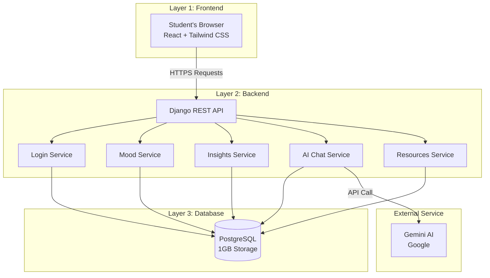
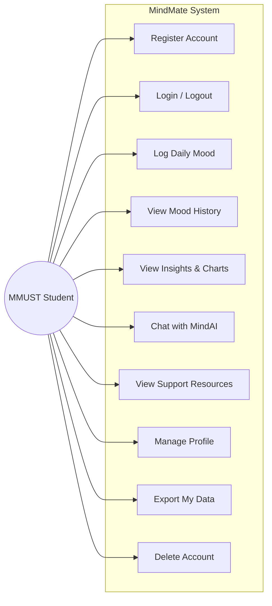
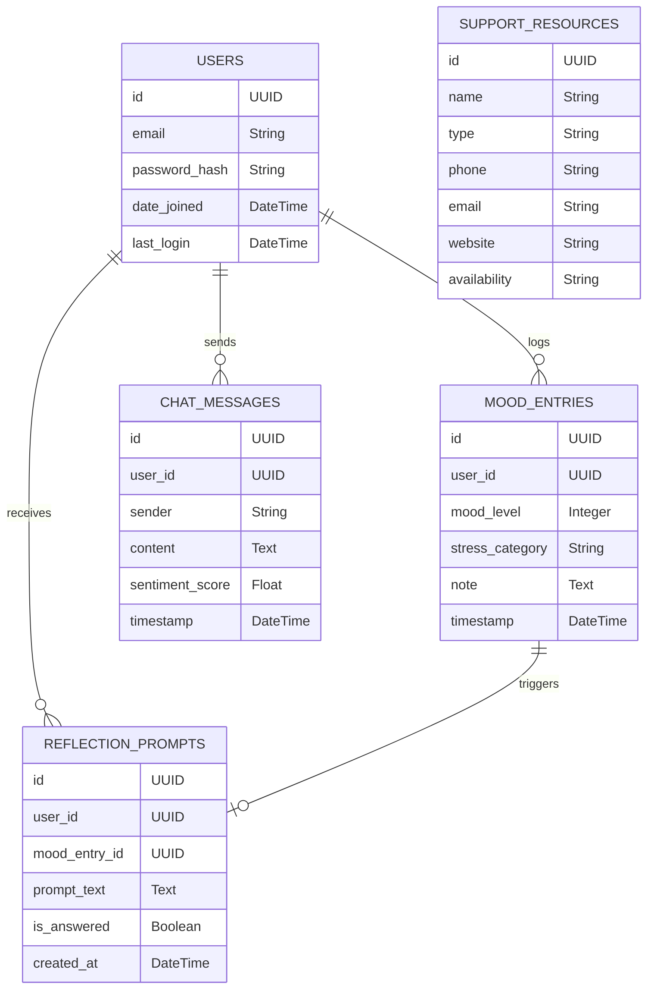
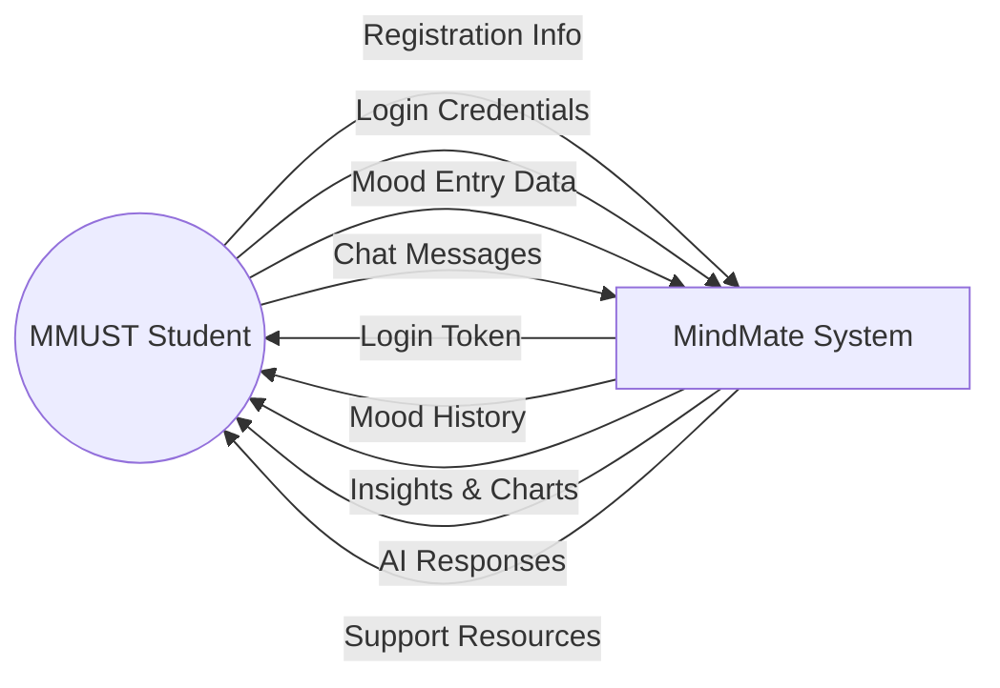
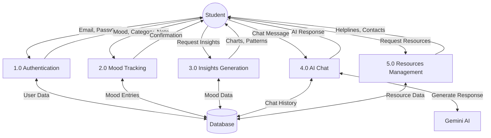
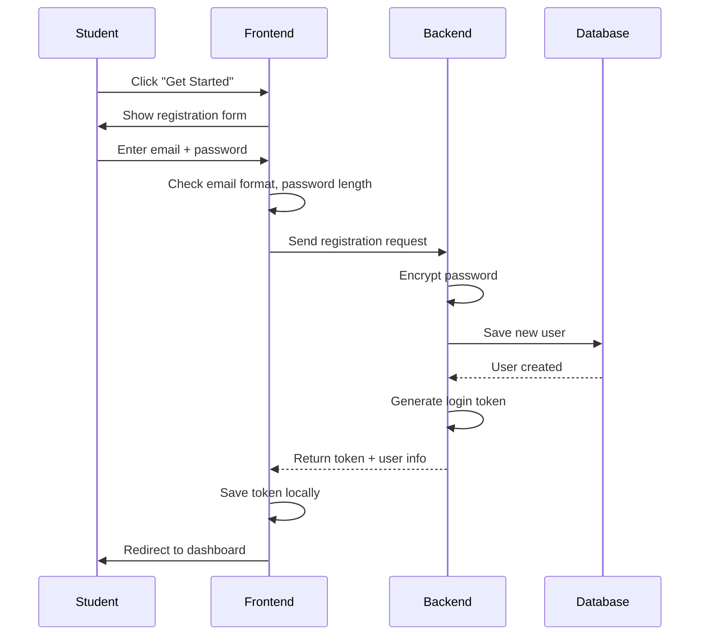
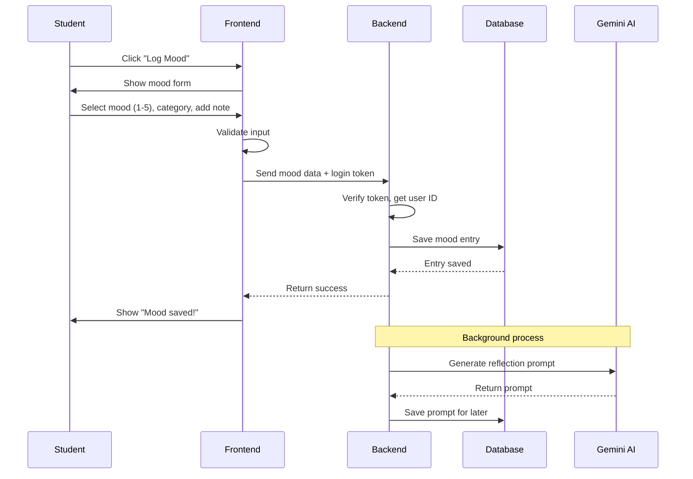
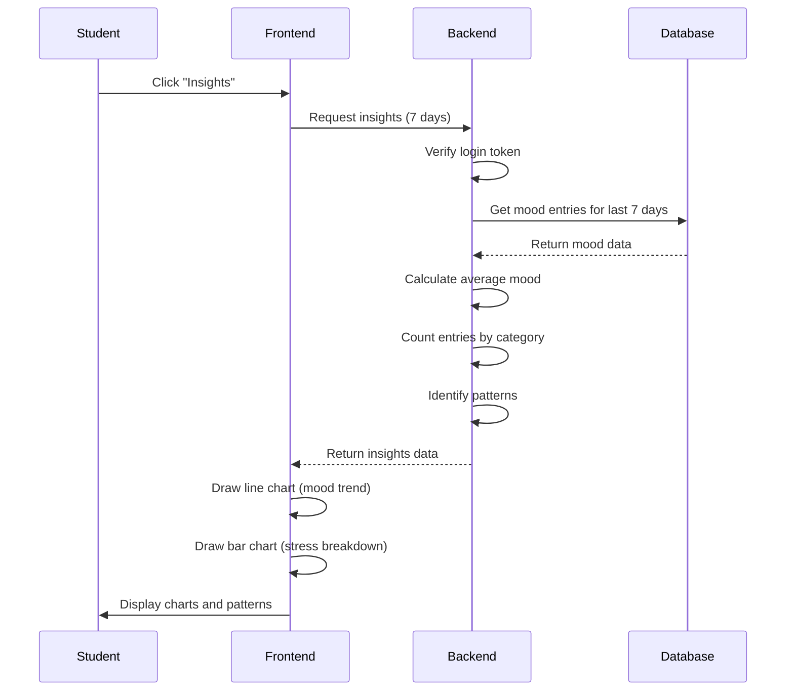
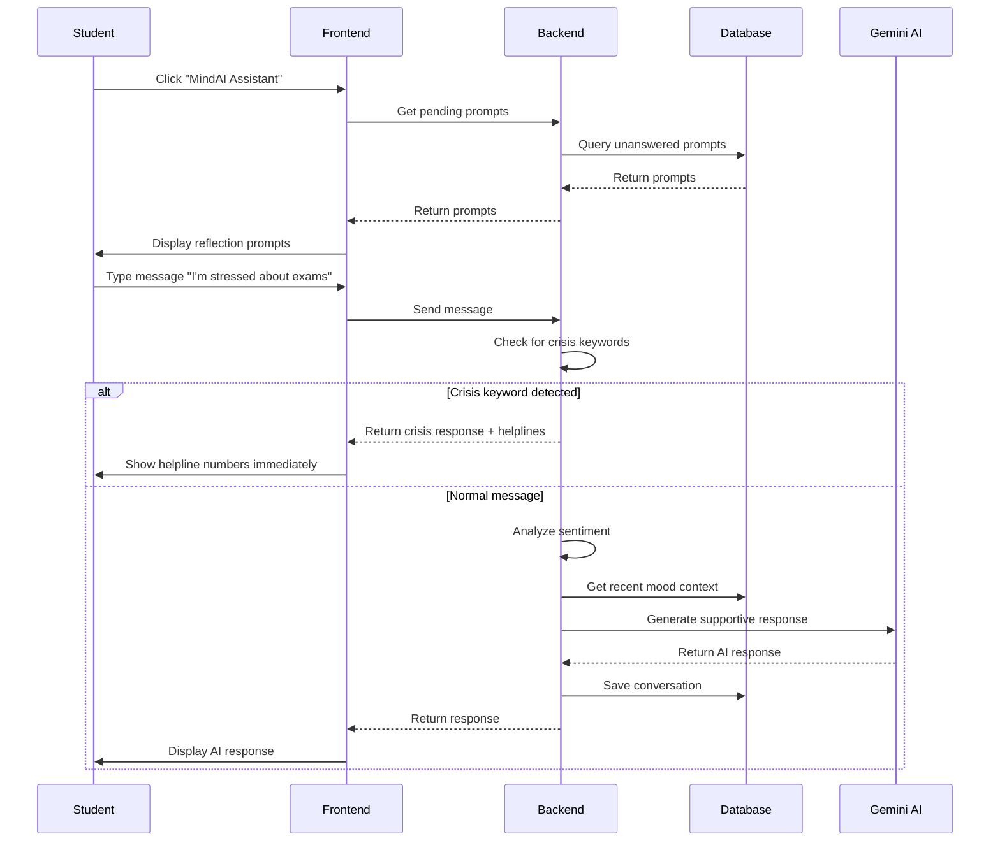
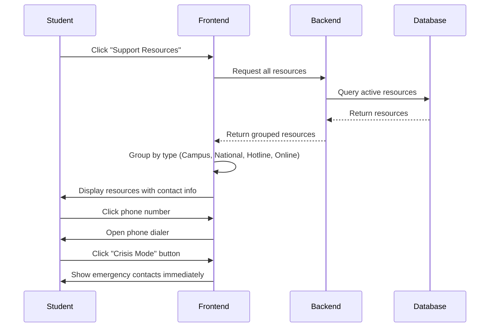

# CHAPTER 3: METHODOLOGY

## 3.1 Requirements Analysis

We talked to 20 MMUST students about mental health and technology. Here's what they told us they need:

**Must-Have Features:**
1. "I want to track my mood daily - something simple, not complicated" → Mood logging with 1-5 scale
2. "I want to see if I'm getting better or worse" → Charts showing mood trends
3. "I want to know why I'm stressed" → Stress categories (Academics, Finances, etc.)
4. "I want someone to talk to, but I'm scared of judgment" → AI chatbot (private, no judgment)
5. "I don't know where to get help" → Resources directory with MMUST counseling, Kenya helplines
6. "I can't afford expensive apps" → Free platform
7. "My data bundle is 500MB" → Lightweight, no videos or heavy downloads
8. "I don't want anyone to know I'm using this" → Privacy, no social features, no sharing

**Nice-to-Have Features:**
1. "Reminders to log my mood" → Daily notification (optional)
2. "Export my data to show my counselor" → Export to CSV
3. "See my most common stress sources" → Stress category breakdown chart

**Won't Have (Out of Scope):**
1. "Connect with other students" → No social features (privacy risk, gossip risk)
2. "Video calls with counselors" → Too complex, too expensive, MMUST counseling handles this
3. "Medication reminders" → We're not medical professionals, liability risk
4. "Diagnosis" → Only professionals can diagnose, we just track moods

### 3.1.1 Functional Requirements

| ID | Requirement | What It Does |
|----|-------------|--------------|
| FR1 | User Registration & Login | Students create accounts and login securely |
| FR2 | Mood Logging | Students log daily mood (1-5) with stress category and notes |
| FR3 | Mood History | Students view, edit, and delete past mood entries |
| FR4 | Mood Insights | System shows charts, averages, and patterns |
| FR5 | AI Chat | Students chat with AI assistant for reflection |
| FR6 | Support Resources | System displays mental health helplines and contacts |
| FR7 | User Profile | Students manage account, export data, delete account |

**FR1: User Registration and Login**
- Student enters email and password
- System checks email format is valid
- System checks password is at least 8 characters
- System encrypts password before storing
- System generates login token (expires in 24 hours)
- Student can login with email and password

**FR2: Mood Logging**
- Student selects mood level 1-5 (😢 😟 😐 🙂 😊)
- Student selects stress category (Academics, Finances, Relationships, Family, Career)
- Student optionally adds note (max 500 characters)
- System saves mood entry with date and time
- System allows one entry per day (updates existing if student logs twice)

**FR3: Mood History**
- Student sees list of past mood entries (newest first)
- Each entry shows: date, mood emoji, category, note preview
- Student can click entry to see full details
- Student can edit or delete their entries
- Student can filter by date range (7/30/90 days)
- Student can filter by stress category

**FR4: Mood Insights**
- System shows 7-day mood trend line chart
- System shows stress category breakdown bar chart
- System calculates average mood for selected period
- System identifies patterns like "Your mood is lowest on Mondays"
- Student can change time period (7/30/90 days)

**FR5: AI Chat**
- Student types message in chat box
- AI responds within 5 seconds with supportive message
- System saves conversation history
- If student mentions crisis keywords ("suicide", "kill myself"), system immediately shows helpline numbers

**FR6: Support Resources Directory**
- System shows mental health resources by category:
  - Campus Counseling (MMUST)
  - National Helplines (1199, Befrienders Kenya)
  - Online Resources
  - Emergency Contacts
- Student can search resources
- "Crisis Mode" button shows emergency contacts immediately

**FR7: User Profile**
- Student can view profile (email, account created date, total mood entries)
- Student can change password
- Student can export data (download all their data)
- Student can delete account permanently


### 3.1.2 Non-Functional Requirements

| ID | Category | Requirement | Target |
|----|----------|-------------|--------|
| NFR1 | Performance | Pages load quickly | Under 3 seconds on 3G |
| NFR2 | Performance | System responds fast | Under 500 milliseconds |
| NFR3 | Performance | Handle many users | 100 concurrent users |
| NFR4 | Security | Passwords encrypted | Bcrypt encryption |
| NFR5 | Security | Data transmitted securely | HTTPS encryption |
| NFR6 | Security | Login sessions expire | 24 hours |
| NFR7 | Security | Data isolation | Students only see their own data |
| NFR8 | Usability | Simple interface | No training needed |
| NFR9 | Usability | Clear feedback | Error and success messages |
| NFR10 | Usability | Works on all devices | Mobile, tablet, desktop |
| NFR11 | Reliability | System available | 95% uptime |
| NFR12 | Reliability | Handles errors gracefully | No crashes |

---

## 3.2 Conceptual Design

### 3.2.1 System Architecture

MindMate uses a three-layer architecture where each layer has one job:

**Layer 1: Frontend (What Students See)**
- Runs in the student's browser (Chrome, Firefox, Safari)
- Shows the user interface (buttons, forms, charts)
- Sends requests to the backend when student takes action
- Built with React and Tailwind CSS
- Size: About 2MB (lightweight for slow internet)

**Layer 2: Backend (The Brain)**
- Runs on a cloud server (Render)
- Handles all the logic (login, save mood, calculate insights)
- Checks if student is allowed to access data
- Talks to the database and AI service
- Built with Django (Python)

**Layer 3: Database (The Memory)**
- Stores all the data permanently
- Tables for: users, mood entries, chat messages, resources
- Built with PostgreSQL
- Storage: 1GB (enough for years of data)

**How They Talk to Each Other:**
- Frontend sends requests to Backend over HTTPS (encrypted)
- Backend queries Database using SQL
- Backend calls AI service (Gemini) for chat responses
- All communication is secure and encrypted

**Figure 3.1: System Architecture Diagram**



**Why This Architecture?**

1. **Separation of Concerns**: Each layer does one thing well. Frontend shows things, backend thinks, database remembers.

2. **Security**: Students can't access the database directly. Everything goes through the backend which checks permissions.

3. **Scalability**: If we get more users, we can upgrade the backend without changing the frontend.

4. **Maintainability**: If we want to build a mobile app later, we just build a new frontend. Backend stays the same.


### 3.2.2 Use Case Diagram

This diagram shows what students can do with MindMate:

**Figure 3.2: Use Case Diagram**



**Use Case Descriptions:**

| Use Case | Description |
|----------|-------------|
| Register Account | Student creates new account with email and password |
| Login / Logout | Student signs in to access their data, signs out when done |
| Log Daily Mood | Student records how they feel (1-5) and what's stressing them |
| View Mood History | Student sees all their past mood entries |
| View Insights & Charts | Student sees mood trends, averages, and patterns |
| Chat with MindAI | Student talks to AI assistant for reflection and support |
| View Support Resources | Student finds helplines and counseling contacts |
| Manage Profile | Student updates password and account settings |
| Export My Data | Student downloads all their data |
| Delete Account | Student permanently removes their account and data |

### 3.2.3 Database Design (Entity Relationship Diagram)

The database stores all MindMate data in 5 tables:

**Figure 3.3: Entity Relationship Diagram (ERD)**



**Table Descriptions:**

| Table | Purpose | Key Fields |
|-------|---------|------------|
| USERS | Stores student accounts | email, password (encrypted), join date |
| MOOD_ENTRIES | Stores daily mood logs | mood level (1-5), stress category, note, date |
| CHAT_MESSAGES | Stores AI chat history | message content, who sent it (student or AI), sentiment |
| REFLECTION_PROMPTS | Stores AI-generated prompts | prompt text, whether student answered |
| SUPPORT_RESOURCES | Stores helpline contacts | name, phone, email, availability |

**Relationships:**
- One student can have many mood entries (1 to many)
- One student can have many chat messages (1 to many)
- One mood entry can trigger one reflection prompt (1 to 1)
- Support resources are independent (no relationship to users)

**Data Protection:**
- When a student deletes their account, ALL their data is deleted (mood entries, chats, prompts)
- Students can only see their own data, never other students' data


---

## 3.3 Functional Design

### 3.3.1 Data Flow Diagram (Level 0 - Context Diagram)

This shows how data moves between the student and MindMate:

**Figure 3.4: Context Diagram (DFD Level 0)**



### 3.3.2 Data Flow Diagram (Level 1 - System Processes)

This shows the main processes inside MindMate:

**Figure 3.5: Data Flow Diagram (DFD Level 1)**



### 3.3.3 User Registration Flow

This is what happens when a student creates an account:

**Figure 3.6: User Registration Sequence Diagram**



**Steps Explained:**
1. Student clicks "Get Started" on landing page
2. Frontend shows registration form
3. Student enters email and password
4. Frontend checks if email is valid and password is 8+ characters
5. Frontend sends data to backend
6. Backend encrypts password (never stored as plain text)
7. Backend saves user to database
8. Backend creates login token (valid for 24 hours)
9. Frontend saves token and redirects to dashboard


### 3.3.4 Mood Logging Flow

This is what happens when a student logs their mood:

**Figure 3.7: Mood Logging Sequence Diagram**



**Steps Explained:**
1. Student clicks "Log Mood" button
2. Frontend shows mood form with emoji buttons and category dropdown
3. Student selects mood (1-5), picks stress category, optionally adds note
4. Frontend checks: Is mood between 1-5? Is category selected? Is note under 500 characters?
5. Frontend sends data to backend with login token
6. Backend verifies token is valid and extracts student's ID
7. Backend saves mood entry to database
8. Frontend shows success message
9. In the background, AI generates a reflection prompt for the student

### 3.3.5 Viewing Insights Flow

This is what happens when a student views their mood insights:

**Figure 3.8: Insights Viewing Sequence Diagram**



**Steps Explained:**
1. Student clicks "Insights" in navigation
2. Frontend requests insights for last 7 days
3. Backend verifies student is logged in
4. Backend gets all mood entries from database
5. Backend calculates: average mood, entries per category, patterns
6. Frontend receives data and draws charts
7. Student sees their mood trend and stress breakdown

**What Insights Show:**
- Line chart: Mood level over time (see if improving or declining)
- Bar chart: Which stress categories appear most often
- Average mood: Overall mood score for the period
- Patterns: "You had 3 low mood days" or "Finances stress you most"


### 3.3.6 AI Chat Flow

This is what happens when a student chats with MindAI:

**Figure 3.9: AI Chat Sequence Diagram**



**Steps Explained:**
1. Student opens AI chat
2. System shows any pending reflection prompts
3. Student types a message
4. Backend FIRST checks for crisis keywords ("suicide", "kill myself", etc.)
5. If crisis detected: Immediately show helpline numbers (no AI delay)
6. If normal message: Analyze sentiment, get context, generate AI response
7. Save conversation to database
8. Display AI response to student

**Crisis Safety Feature:**
This is critical. If a student mentions suicide or self-harm:
- System does NOT wait for AI to respond
- System IMMEDIATELY shows:
  - MMUST Counseling: [phone number]
  - Kenya Crisis Hotline: 1190 (toll-free, 24/7)
  - Befrienders Kenya: +254-722-178177
- This happens in under 1 second

### 3.3.7 Support Resources Flow

This is what happens when a student views support resources:

**Figure 3.10: Support Resources Sequence Diagram**



**Resources Categories:**
| Category | Examples |
|----------|----------|
| Campus | MMUST Counseling Office |
| National | Kenya Mental Health Helpline |
| Hotline | Befrienders Kenya (24/7) |
| Online | Mental health websites |

---

## 3.4 Development Environment

### 3.4.1 Hardware Requirements

**What We Need to Build MindMate:**

| Component | Minimum | Recommended |
|-----------|---------|-------------|
| Laptop | Any working laptop | HP, Lenovo, Dell |
| RAM | 8 GB | 16 GB |
| Storage | 256 GB SSD | 512 GB SSD |
| Internet | 1 Mbps | 5 Mbps |

We don't need expensive hardware. Any laptop that can run a web browser and code editor works fine.

**Production Server (Where MindMate Runs):**

| Component | Specification |
|-----------|---------------|
| Provider | Render (cloud hosting) |
| CPU | Shared |
| RAM | 512 MB |
| Database Storage | 1 GB |
| Bandwidth | Unlimited |
| SSL Certificate | Automatic (free) |

### 3.4.2 Software Requirements

**Development Tools:**

| Software | Purpose |
|----------|---------|
| VS Code | Write code |
| Git | Track code changes |
| Chrome | Test the website |
| Postman | Test the API |

**Frontend Technologies:**

| Technology | Purpose |
|------------|---------|
| React | Build user interface |
| Tailwind CSS | Style the pages |
| Chart.js | Draw mood charts |
| Axios | Send requests to backend |

**Backend Technologies:**

| Technology | Purpose |
|------------|---------|
| Python | Programming language |
| Django | Web framework |
| PostgreSQL | Database |
| JWT | Login tokens |

**External Services:**

| Service | Purpose | Cost |
|---------|---------|------|
| Render | Host the website | Free |
| Gemini AI | Power the chatbot | Free |
| GitHub | Store code | Free |


---

## 3.5 Development Process

### 3.5.1 Methodology: Agile with 1-Week Sprints

We use Agile methodology - build in small pieces, get feedback, improve, repeat.

**Why Agile?**
- We can show working features every week
- We can change direction based on feedback
- Problems are found early, not at the end
- Supervisors see progress twice a week

**Sprint Structure (1 week):**

| Day | Activity |
|-----|----------|
| Monday | Sprint planning - decide what to build this week |
| Tuesday - Thursday | Work on assigned tasks individually |
| Wednesday | Meet with supervisors - progress check |
| Friday | Demo to supervisors, get feedback, plan next sprint |

**How We Work:**
- We meet supervisors twice a week (Wednesday and Friday)
- Between meetings, each member works on their assigned tasks independently
- We divide features into smaller tasks so everyone can contribute
- Example: For a frontend feature, one person builds the form, another builds the display, another handles the API connection

We work collectively - when a feature is assigned, we break it into smaller tasks and divide among ourselves. No one person owns a whole module; we all contribute to everything based on what needs to be done that week.

### 3.5.2 Version Control with Git

We use Git to track all code changes:

```
main (production - live website)
  │
  └── develop (testing)
        │
        ├── feature/login
        ├── feature/mood-logging
        ├── feature/insights
        └── feature/ai-chat
```

**How It Works:**
1. Each feature gets its own branch
2. Developer builds the feature
3. Another team member reviews the code
4. If approved, merge to develop branch
5. After testing, merge to main (goes live)

### 3.5.3 Testing Strategy

| Test Type | What We Test | When |
|-----------|--------------|------|
| Unit Tests | Individual functions | During development |
| Integration Tests | Features working together | After each feature |
| Manual Testing | Use the app like a student | Before each demo |
| User Testing | Real MMUST students try it | Week 22 |
| Security Testing | Try to hack the system | Week 24 |

---

## 3.6 Development Schedule

### 3.6.1 Project Timeline (28 Weeks)

**Figure 3.11: Gantt Chart**

```
PHASE 1: PLANNING & DESIGN (Weeks 1-4)
════════════════════════════════════════════════════════════════════════════════
Week 1-2   │████████│ Requirements Gathering
Week 3-4   │        │████████│ System Design & Mockups

PHASE 2: BACKEND DEVELOPMENT (Weeks 5-12)
════════════════════════════════════════════════════════════════════════════════
Week 5-6   │████████│ Authentication API
Week 7-8   │        │████████│ Mood Logging API
Week 9-10  │                │████████│ Insights API
Week 11-12 │                        │████████│ AI Chat API

PHASE 3: FRONTEND DEVELOPMENT (Weeks 13-20)
════════════════════════════════════════════════════════════════════════════════
Week 13-14 │████████│ Login & Registration Pages
Week 15-16 │        │████████│ Mood Logging Pages
Week 17-18 │                │████████│ Insights & Charts
Week 19-20 │                        │████████│ AI Chat & Resources

PHASE 4: TESTING (Weeks 21-24)
════════════════════════════════════════════════════════════════════════════════
Week 21    │████│ Integration Testing
Week 22    │    │████│ User Testing (10 MMUST students)
Week 23    │        │████│ Bug Fixes
Week 24    │            │████│ Security Testing

PHASE 5: DEPLOYMENT (Weeks 25-28)
════════════════════════════════════════════════════════════════════════════════
Week 25    │████│ Deploy to Render
Week 26    │    │████│ Documentation
Week 27    │        │████│ Final Report
Week 28    │            │████│ Presentation

Legend: ████ = Work Period
```

### 3.6.2 Phase Details

**Phase 1: Planning & Design (Weeks 1-4)**
- Interview 20 MMUST students about their needs
- Research existing apps (Daylio, Headspace, etc.)
- Write requirements document
- Design database structure
- Create UI mockups for all screens
- Deliverable: Design document with mockups

**Phase 2: Backend Development (Weeks 5-12)**
- Build user registration and login
- Build mood logging functionality
- Build insights calculations
- Build AI chat integration
- Write tests for all features
- Deliverable: Working API

**Phase 3: Frontend Development (Weeks 13-20)**
- Build all user interface screens
- Connect frontend to backend
- Add charts and visualizations
- Make it work on mobile phones
- Deliverable: Working website

**Phase 4: Testing (Weeks 21-24)**
- Test all features work together
- Have 10 MMUST students try the app
- Fix bugs and issues found
- Test security (try to hack it)
- Deliverable: Bug-free system

**Phase 5: Deployment (Weeks 25-28)**
- Put the website online (Render)
- Write user guide
- Write final project report
- Prepare presentation
- Deliverable: Live website + final report

### 3.6.3 Milestones

| Week | Milestone | Deliverable |
|------|-----------|-------------|
| 4 | Design Complete | Requirements doc, mockups, diagrams |
| 12 | Backend Complete | All APIs working |
| 20 | Frontend Complete | All screens working |
| 24 | Testing Complete | Bug-free system |
| 25 | Deployment Complete | Live at mindmate.onrender.com |
| 28 | Project Complete | Final report + presentation |

### 3.6.4 Risk Management

| Risk | Likelihood | Impact | How We Handle It |
|------|------------|--------|------------------|
| Team member unavailable | Low | High | Everyone knows multiple parts |
| Free hosting limits exceeded | Medium | Medium | Upgrade to paid ($7/month) |
| AI API limits exceeded | Medium | Medium | Use backup sentiment analysis |
| Internet outages | High | Low | Work offline, use mobile data |
| Too many features requested | Medium | High | Stick to requirements, say no |
| Bugs found late | Medium | Medium | Test continuously |


---

## 3.7 Development Budget

**Total Budget: KES 0 - 6,500**

We designed MindMate to run on free tools. Here's the breakdown:

### 3.7.1 Software Costs: KES 0

| Item | Cost | Why Free |
|------|------|----------|
| React | KES 0 | Open source |
| Django | KES 0 | Open source |
| PostgreSQL | KES 0 | Open source |
| VS Code | KES 0 | Free from Microsoft |
| Git | KES 0 | Open source |
| GitHub | KES 0 | Free for students |

### 3.7.2 Hosting Costs: KES 0

| Service | Free Tier Limit | Our Usage | Cost |
|---------|-----------------|-----------|------|
| Render (Frontend) | Unlimited | 2 MB | KES 0 |
| Render (Backend) | 750 hours/month | ~100 hours | KES 0 |
| Render (Database) | 1 GB | ~200 MB | KES 0 |
| Gemini AI | 1,500 requests/day | ~500 requests | KES 0 |

**Why Free Tier Works:**
- Our app is lightweight (2 MB)
- We expect 100-500 students initially
- Database grows slowly (500 bytes per mood entry)
- AI requests are limited to chat feature

### 3.7.3 Optional Costs

| Item | Cost | Notes |
|------|------|-------|
| Domain name (.co.ke) | KES 3,500/year | Optional - can use free subdomain |
| Contingency fund | KES 3,000 | For unexpected costs |

### 3.7.4 Total Budget Summary

| Category | Cost |
|----------|------|
| Software | KES 0 |
| Hosting | KES 0 |
| AI Service | KES 0 |
| Domain (optional) | KES 0 - 3,500 |
| Contingency | KES 3,000 |
| **TOTAL** | **KES 3,000 - 6,500** |

### 3.7.5 Cost Comparison

| Solution | Monthly Cost (100 students) |
|----------|----------------------------|
| Headspace subscription | KES 195,000 |
| Sanvello subscription | KES 135,000 |
| Private therapy | KES 200,000+ |
| **MindMate** | **KES 0** |

MindMate is free for students because we use free-tier services and open-source software.


---

## 3.8 References

Andersson, G., Cuijpers, P., Carlbring, P., Riper, H., & Hedman, E. (2014). Guided Internet-based vs. face-to-face cognitive behavior therapy for psychiatric and somatic disorders: A systematic review and meta-analysis. *World Psychiatry*, 13(3), 288-295.

Atwoli, L., Mungla, P. A., Ndung'u, M. N., Kinoti, K. C., & Ogot, E. M. (2017). Prevalence of substance use among college students in Eldoret, western Kenya. *BMC Psychiatry*, 11(1), 34.

De Choudhury, M., Gamon, M., Counts, S., & Horvitz, E. (2013). Predicting depression via social media. *Proceedings of the International AAAI Conference on Web and Social Media*, 7(1), 128-137.

Lattie, E. G., Adkins, E. C., Winquist, N., Stiles-Shields, C., Wafford, Q. E., & Graham, A. K. (2019). Digital mental health interventions for depression, anxiety, and enhancement of psychological well-being among college students: Systematic review. *Journal of Medical Internet Research*, 21(7), e12869.

Ndetei, D. M., Khasakhala, L. I., Mutiso, V., & Mbwayo, A. W. (2016). Knowledge, attitude and practice (KAP) of mental illness among staff in general medical facilities in Kenya: Practice and policy implications. *African Journal of Psychiatry*, 14(3), 225-235.

Othieno, C. J., Okoth, R. O., Peltzer, K., Pengpid, S., & Malla, L. O. (2014). Depression among university students in Kenya: Prevalence and sociodemographic correlates. *Journal of Affective Disorders*, 165, 120-125.

Pennebaker, J. W. (1997). Writing about emotional experiences as a therapeutic process. *Psychological Science*, 8(3), 162-166.

Torous, J., Nicholas, J., Larsen, M. E., Firth, J., & Christensen, H. (2018). Clinical review of user engagement with mental health smartphone apps: Evidence, theory and improvements. *Evidence-Based Mental Health*, 21(3), 116-119.

World Health Organization. (2021). *Mental health of adolescents*. WHO Fact Sheet. Retrieved from https://www.who.int/news-room/fact-sheets/detail/adolescent-mental-health